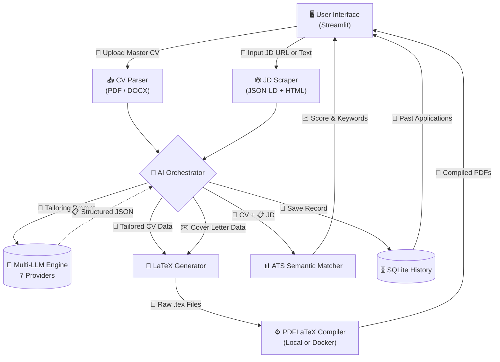

<div align="center">

  # 🚀 AgenticCV

  ### **AI-Powered Job Application Engine**

  *Tailor your CV & Cover Letter to any Job Description in seconds — powered by 7 LLM providers, compiled to professional LaTeX PDFs, with real-time ATS scoring.*

  <br/>

  [](https://github.com/Bhargav1488-max/AgenticCV/issues)
  [](https://github.com/Bhargav1488-max/AgenticCV/pulls)
  [](https://github.com/Bhargav1488-max/AgenticCV/blob/main/LICENSE)
  [](https://www.python.org/)
  [](https://streamlit.io/)
  [](https://www.docker.com/)

</div>

<br/>

---

<br/>

## 📑 Table of Contents

- [✨ Features](#-features)
- [🏗️ Architecture](#️-architecture)
- [🚀 Getting Started](#-getting-started)
  - [🐳 Docker (Recommended)](#-option-1-docker-recommended)
  - [💻 Local Development](#-option-2-local-development)
- [🐳 Docker Commands](#-docker-commands)
- [📖 How to Use](#-how-to-use)
- [⚙️ Configuration](#️-configuration)
  - [🔑 API Keys](#-api-keys)
  - [🤖 Supported LLM Providers & Models](#-supported-llm-providers--models)
  - [🎛️ Sidebar Settings](#️-sidebar-settings)
- [📁 Project Structure](#-project-structure)
- [🧩 Module Reference](#-module-reference)
- [🔧 Technical Details](#-technical-details)
- [🗺️ Roadmap](#️-roadmap)
- [📜 License](#-license)

<br/>

---

<br/>

## ✨ Features

| Feature | Description |
|---|---|
| 🧠 **Multi-LLM Engine** | 7 providers out of the box — Google Gemini, Groq, GitHub Models, NVIDIA NIM, OpenRouter, Cohere, and Azure OpenAI. Swap providers with a single click. |
| 🎯 **Surgical CV Tailoring** | AI rewrites your CV to match any job description. Toggle exactly which sections to modify (Title, Summary, Skills, Experience) while preserving everything else. |
| 📄 **LaTeX PDF Pipeline** | Professional, deterministic PDFs generated via LaTeX compilation. No WYSIWYG inconsistencies — pixel-perfect output every time. |
| ✉️ **Cover Letter Generation** | Auto-generates a tailored cover letter matched to the job description and your CV, compiled to PDF. |
| 📊 **AI-Powered ATS Scoring** | Real-time Applicant Tracking System analysis with visual gauge chart, matched/missing keywords, and actionable recommendations. |
| 🕸️ **Smart JD Scraping** | Paste a job description or provide a URL. The scraper extracts structured data from JSON-LD schema or falls back to intelligent HTML parsing. |
| 📥 **Multi-Format CV Import** | Upload your master CV as PDF or DOCX — text extraction is automatic. |
| 🐳 **Fully Dockerized** | One command to build and run. TeX Live, Python, and all dependencies are bundled. Zero local installation needed. |
| 🔒 **Security** | Runs as a non-root user inside Docker. API keys are never stored — entered per session or loaded from environment variables. |
| 🌍 **Multi-Language** | Generate CVs and cover letters in English or French. |
| 📐 **Flexible Formatting** | Choose between 1-Page (compact, tight margins) or 2-Page (spacious) layouts. Multiple CV templates available. |

<br/>

---

<br/>

## 🏗️ Architecture



### 🔄 End-to-End Pipeline

```
📄 Upload CV  →  🕸️ Provide JD  →  🎛️ Set Options  →  🚀 Generate
                                                            │
                    ┌───────────────────────────────────────┘
                    │
                    ▼
        ┌─────────────────────┐
        │  🧠 LLM Processing  │
        │                     │
        │  CV Prompt ──► JSON │
        │  CL Prompt ──► JSON │
        └────────┬────────────┘
                 │
                 ▼
        ┌─────────────────────┐
        │  📐 LaTeX Generator  │
        │                     │
        │  JSON ──► .tex      │
        └────────┬────────────┘
                 │
                 ▼
        ┌─────────────────────┐
        │  ⚙️ PDF Compiler     │
        │                     │
        │  .tex ──► .pdf      │
        │  (Local or Docker)  │
        └────────┬────────────┘
                 │
                 ▼
        📄 Download PDF + 📊 ATS Score
```

<br/>

---

<br/>

## 🚀 Getting Started

### 📋 Prerequisites

| Requirement | Docker Setup | Local Setup |
|---|---|---|
| **Docker Desktop** | ✅ Required | ⬜ Optional (for LaTeX fallback) |
| **Python 3.10+** | ⬜ Not needed | ✅ Required |
| **LaTeX (TeX Live / MiKTeX)** | ⬜ Bundled in image | ⬜ Optional (auto-delegates to Docker) |
| **LLM API Key** | ✅ At least one | ✅ At least one |

---

### 🐳 Option 1: Docker (Recommended)

The fastest way to get running — **no Python, no LaTeX, no dependencies to install**.

```bash
# 1. Clone the repository
git clone https://github.com/Bhargav1488-max/AgenticCV.git
cd AgenticCV

# 2. Build and start the container
docker compose up -d --build

# 3. Open in your browser
# Navigate to http://localhost:8501
```

✅ That's it. The app is live at **http://localhost:8501**.

> **💡 What happens under the hood:**
> - Multi-stage Docker build installs TeX Live (LaTeX), Python 3.11, and all pip dependencies.
> - Runs as a non-root user (`appuser`) for security.
> - Health checks ensure the app stays responsive.
> - Generated PDFs persist in the `./output/` volume mount.

---

### 💻 Option 2: Local Development

```bash
# 1. Clone the repository
git clone https://github.com/Bhargav1488-max/AgenticCV.git
cd AgenticCV

# 2. Create and activate virtual environment
python -m venv venv

# On macOS / Linux:
source venv/bin/activate

# On Windows:
.\venv\Scripts\activate

# 3. Install Python dependencies
pip install -r requirements.txt

# 4. Run the app
streamlit run app.py
```

Open **http://localhost:8501** in your browser.

> **📝 Note on LaTeX compilation:**
> When running locally, AgenticCV automatically handles PDF compilation:
> 1. ✅ If `pdflatex` is installed locally → uses it directly.
> 2. 🐳 If not → delegates compilation to the Docker container (requires `docker compose up -d --build` to have been run at least once).
> 3. ❌ If neither is available → shows an error with installation links.

<br/>

---

<br/>

## 🐳 Docker Commands

| Command | Description |
|---|---|
| `docker compose up -d --build` | 🔨 Build image + start container |
| `docker compose up -d` | ▶️ Start container (without rebuilding) |
| `docker compose down` | ⏹️ Stop and remove container |
| `docker compose restart` | 🔄 Restart container |
| `docker compose logs -f` | 📜 Follow live logs |
| `docker compose logs --tail 50` | 📜 View last 50 log lines |
| `docker ps` | 📋 List running containers |
| `docker exec -it job-app-assistant bash` | 🖥️ Shell into the container |

### 🏗️ Docker Architecture

```
┌──────────────────────────────────────────────┐
│              Docker Container                │
│          (job-app-assistant)                  │
│                                              │
│  🐍 Python 3.11-slim                         │
│  📐 TeX Live (LaTeX)                         │
│  🔤 LModern Fonts                            │
│  📦 All pip dependencies                     │
│                                              │
│  👤 Runs as: appuser (UID 1000)              │
│  🔌 Port: 8501                               │
│  ❤️ Healthcheck: every 30s                   │
│                                              │
│  📂 /app          → Application code         │
│  📂 /app/data     → SQLite DB (mounted)      │
│  📂 /app/output   → Generated PDFs (mounted) │
└──────────────────────────────────────────────┘
        │                    │
        ▼                    ▼
   ./data/ (host)      ./output/ (host)
   Persistent data     Generated files
```

<br/>

---

<br/>

## 📖 How to Use

### 🎯 Step 1: Configure Your LLM Provider

Open the app and use the **sidebar** to:
1. Select an LLM provider (e.g., Google Gemini, Groq).
2. Choose a model.
3. Enter your API key.
4. *(Optional)* Click **🧪 Test Connection** to verify.

### 📄 Step 2: Upload Your Master CV

In the **Tailor Mode** tab:
- Click **📤 Upload your Master CV** and select a PDF or DOCX file.

### 📋 Step 3: Provide the Job Description

Choose one method:
- **📝 Paste Text** — Copy and paste the job description directly.
- **🔗 URL Scraping** — Enter the job posting URL and click **Scrape URL**. The scraper supports JSON-LD structured data and intelligent HTML fallback.

### ⚙️ Step 4: Set Tailoring Options

- 🏢 Enter the **Target Company** and **Target Role**.
- ☑️ Toggle which sections the AI should modify:
  - **CV Title** — Rewrite to match the target role.
  - **Professional Summary** — Reframe for the specific position.
  - **Technical Skills** — Reorder and emphasize relevant skills.
  - **Professional Experience** — Rewrite bullet points with matching keywords.
- ☑️ Choose to generate a **Tailored CV**, **Cover Letter**, or both.

### 🚀 Step 5: Generate

Click **🚀 Generate Applications**. The pipeline:
1. 🧠 Sends your CV + JD to the selected LLM.
2. 📋 Parses the structured JSON response.
3. 📐 Generates LaTeX source code.
4. ⚙️ Compiles to professional PDF.
5. ✅ Results appear in the **CV Preview** and **Cover Letter** tabs.

### 📊 Step 6: Check ATS Score

Switch to the **📊 ATS Match** tab and click **🚀 Calculate Real ATS Score** to get:
- 📈 A visual **gauge chart** with your compatibility score (0–100).
- ✅ **Matched keywords** found in your CV.
- ❌ **Missing keywords** you should consider adding.
- 💡 **Actionable recommendations** for improvement.

### 📥 Step 7: Download

In the **📄 CV Preview** and **✉️ Cover Letter** tabs:
- ⬇️ Download the compiled **PDF**.
- ⬇️ Download the raw **.tex** source for manual editing.
- 👁️ Preview the PDF inline in your browser.

<br/>

---

<br/>

## ⚙️ Configuration

### 🔑 API Keys

Configure API keys via the **UI sidebar** at runtime, or set them as environment variables before starting the app:

```env
# LLM Providers (you only need ONE to get started)
GOOGLE_API_KEY=AIza...          # Google Gemini
GROQ_API_KEY=gsk_...            # Groq (free tier available)
GITHUB_TOKEN=ghp_...            # GitHub Models
NVIDIA_API_KEY=nvapi-...        # NVIDIA NIM
OPENROUTER_API_KEY=sk-or-...    # OpenRouter (free models available)
COHERE_API_KEY=...              # Cohere
AZURE_OPENAI_API_KEY=...        # Azure OpenAI
AZURE_OPENAI_ENDPOINT=https://your-resource.openai.azure.com/
```

> **💡 Tip:** Copy `.env.example` to `.env` and fill in your keys. The app loads `.env` automatically via `python-dotenv`.

---

### 🤖 Supported LLM Providers & Models

| Provider | Models | Free Tier | API Key Variable |
|---|---|---|---|
| 🟦 **Google Gemini** | `gemini-1.5-flash`, `gemini-1.5-pro`, `gemini-2.0-flash-exp` | ✅ Yes | `GOOGLE_API_KEY` |
| ⚡ **Groq** | `llama-3.3-70b-versatile`, `llama-3.1-8b-instant`, `mixtral-8x7b-32768`, `gemma2-9b-it` | ✅ Yes | `GROQ_API_KEY` |
| 🐙 **GitHub Models** | `gpt-4o`, `gpt-4o-mini`, `Mistral-large` | ✅ Yes | `GITHUB_TOKEN` |
| 🟢 **NVIDIA NIM** | `meta/llama-3.1-70b-instruct`, `meta/llama-3.1-8b-instruct`, `mistralai/mixtral-8x22b-instruct` | ✅ Yes | `NVIDIA_API_KEY` |
| 🌐 **OpenRouter** | `openai/gpt-4o-mini`, `anthropic/claude-3.5-sonnet`, `google/gemini-1.5-flash`, `meta-llama/llama-3.1-8b-instruct:free` | ✅ Free models | `OPENROUTER_API_KEY` |
| 🟠 **Cohere** | `command-r-plus`, `command-r` | ✅ Yes | `COHERE_API_KEY` |
| 🔷 **Azure OpenAI** | `gpt-4o`, `gpt-4o-mini`, `gpt-35-turbo` | ❌ Paid | `AZURE_OPENAI_API_KEY` |

> **📝 Custom Provider:** Select "Custom / Manual" in the sidebar to use any OpenAI-compatible API endpoint.

---

### 🎛️ Sidebar Settings

| Setting | Options | Default | Description |
|---|---|---|---|
| 🤖 **Provider** | 7 providers + Custom | — | LLM provider selection |
| 🧩 **Model** | Provider-specific | Provider default | Model to use for generation |
| 🔑 **API Key** | Text input | From env var | Authentication key |
| 🌡️ **Temperature** | 0.0 – 1.0 | 0.7 | Creativity level (lower = more focused) |
| 🌍 **Language** | English, French | English | Output language |
| 📐 **CV Template** | Modern, Classic, ATS-Safe | Modern | LaTeX template style |
| 📏 **Page Length** | 1-Page, 2-Page | 1-Page | CV format (affects margins & spacing) |

<br/>

---

<br/>

## 📁 Project Structure

```
AgenticCV/
│
├── 📄 app.py                      # 🚀 Streamlit entrypoint — tab layout & routing
├── 📄 config.yaml                 # ⚙️ LLM providers, models & app settings
├── 📄 requirements.txt            # 📦 Python dependencies (16 packages)
├── 🐳 Dockerfile                  # 🏗️ Multi-stage build (base → builder → runtime)
├── 🐳 docker-compose.yml          # 🔧 Container orchestration & volume mounts
├── 📄 .env.example                # 🔑 Environment variable template
├── 📄 .gitignore                  # 🙈 Git ignore rules
├── 📄 packages.txt                # ☁️ Streamlit Cloud system dependencies
│
├── 📂 modules/                    # ⚙️ Backend logic
│   ├── 🧠 llm_engine.py           #    Multi-provider LLM abstraction (7 providers)
│   ├── 📥 cv_parser.py            #    PDF & DOCX text extraction
│   ├── 🕸️ jd_scraper.py           #    Job description URL scraper (JSON-LD + HTML)
│   ├── 📐 latex_generator.py      #    LaTeX template engine (CV + Cover Letter)
│   ├── ⚙️ latex_compiler.py       #    PDF compilation (local pdflatex + Docker fallback)
│   ├── 📊 ats_scorer.py           #    TF-IDF cosine similarity ATS scorer
│   ├── 📝 prompts.py              #    LLM prompt templates (CV tailoring + CL generation)
│   ├── 🔧 config_loader.py        #    YAML config & .env loader
│   ├── 💾 history_manager.py      #    SQLite application history persistence
│   ├── 🔤 utils.py                #    LaTeX escaping & filename sanitization
│   └── 🏗️ manual_form_builder.py  #    Manual form data combiner
│
├── 📂 ui/                         # 🖥️ Frontend tabs
│   ├── 🎛️ sidebar.py              #    Settings sidebar (provider, model, key, options)
│   ├── 🎯 tab_tailor.py           #    AI CV tailoring workflow (core feature)
│   ├── 📝 tab_manual.py           #    Manual CV builder form
│   ├── 📊 tab_ats.py              #    ATS match analysis with gauge chart
│   ├── 📄 tab_cv_preview.py       #    CV preview & PDF/TEX download
│   ├── ✉️ tab_cover_letter.py     #    Cover letter preview & download
│   └── 📁 tab_history.py          #    Application history tracker
│
├── 📂 output/                     # 📄 Generated .tex and .pdf files
└── 📂 data/                       # 💾 SQLite database & uploaded files
```

<br/>

---

<br/>

## 🧩 Module Reference

### ⚙️ Backend Modules (`modules/`)

#### 🧠 `llm_engine.py` — Multi-Provider LLM Engine

The core abstraction layer that provides a unified interface to 7 LLM providers.

| Function | Description |
|---|---|
| `generate_text(provider, model, prompt, api_key, temperature)` | Sends a prompt to the selected provider and returns the response text. Handles all provider-specific SDK differences internally. |
| `test_connection(provider, model, api_key)` | Validates API key and connectivity with a lightweight test prompt. Returns `(success: bool, message: str)`. |

**Provider Implementations:**
| Provider | SDK / Method |
|---|---|
| Google Gemini | `google.generativeai` SDK → `GenerativeModel.generate_content()` |
| Groq | `groq` SDK → Chat completions API |
| Cohere | `cohere` SDK → `co.generate()` |
| GitHub Models | `openai` SDK → `https://models.inference.ai.azure.com` |
| NVIDIA NIM | `openai` SDK → `https://integrate.api.nvidia.com/v1` |
| OpenRouter | Raw HTTP `requests.post()` → `https://openrouter.ai/api/v1/chat/completions` |
| Azure OpenAI | `openai.AzureOpenAI` → configurable endpoint |

---

#### 📥 `cv_parser.py` — Document Parser

| Function | Description |
|---|---|
| `parse_cv(uploaded_file)` | Extracts plain text from uploaded PDF (via `pypdf`) or DOCX (via `python-docx`) files. Returns concatenated text string. |

---

#### 🕸️ `jd_scraper.py` — Job Description Scraper

| Function | Description |
|---|---|
| `scrape_jd(url)` | Fetches a job posting URL and extracts the description. **Strategy 1:** Parses JSON-LD `JobPosting` schema. **Strategy 2:** Falls back to intelligent HTML text extraction (strips nav, footer, scripts). |

---

#### 📐 `latex_generator.py` — LaTeX Template Engine

| Function | Description |
|---|---|
| `generate_latex_cv(cv_data, template_type, page_length)` | Converts structured CV data (JSON dict) into a complete LaTeX document. Handles name, title, contact, summary, skills, experience (with bullet points), education, certifications, and languages. Dynamic margins based on page length. |
| `generate_latex_cl(cl_data)` | Converts cover letter data into a LaTeX document with header, contact info, and body text. |

**LaTeX Packages Used:** `geometry`, `enumitem`, `titlesec`, `hyperref`, `fontenc`, `inputenc`, `lmodern`, `xcolor`.

---

#### ⚙️ `latex_compiler.py` — Smart PDF Compiler

| Function | Description |
|---|---|
| `compile_latex(tex_content, output_filename)` | Writes `.tex` file and compiles to PDF. Automatically detects the best compilation method. |
| `_compile_local(...)` | Uses locally installed `pdflatex`. |
| `_compile_via_docker(...)` | Falls back to Docker container with TeX Live. Handles Windows path conversion. |
| `_is_running_in_docker()` | Detects if running inside a Docker container. |

**Compilation Strategy:**
```
pdflatex on PATH? ──Yes──► Compile locally (fast)
        │
        No
        │
        ▼
Docker available? ──Yes──► Compile via container
        │                   (agentic-cv-app image)
        No
        │
        ▼
Show error with install links
```

---

#### 📊 `ats_scorer.py` — TF-IDF ATS Scorer

| Function | Description |
|---|---|
| `calculate_ats_score(cv_text, jd_text)` | Computes ATS compatibility using TF-IDF vectorization + cosine similarity. Returns `(score, matched_keywords, missing_keywords)`. Removes stop words, caps results at 20 keywords each. |

---

#### 📝 `prompts.py` — LLM Prompt Templates

| Constant | Description |
|---|---|
| `TAILOR_CV_PROMPT` | Instructs the LLM to act as an ATS-optimized CV writer. Includes section-by-section modification flags (`{modify_title}`, `{modify_summary}`, `{modify_skills}`, `{modify_exp}`). Outputs strict JSON schema. |
| `COVER_LETTER_PROMPT` | Instructs the LLM as an expert career consultant. Takes CV + JD context. Outputs JSON with name, contact, and body text. |

---

#### 🔧 `config_loader.py` — Configuration Loader

| Function | Description |
|---|---|
| `load_config(config_path)` | Reads and parses `config.yaml`. Returns dict. |
| `get_providers()` | Returns the `providers` dictionary from config. |
| `get_languages()` | Returns language list (default: English, French). |
| `get_templates()` | Returns CV template list (default: Modern, Classic, ATS-Safe). |

Also calls `load_dotenv()` at import time to load `.env` file.

---

#### 💾 `history_manager.py` — Application History

SQLite database at `data/applications.db`.

| Function | Description |
|---|---|
| `init_db()` | Creates the `applications` table if not exists. |
| `get_all_applications()` | Returns all saved applications (newest first). |
| `add_application(date, company, role, score, status)` | Inserts a new application record. |

**Schema:** `id` (auto PK), `date`, `company`, `role`, `score`, `status`.

---

#### 🔤 `utils.py` — Utilities

| Function | Description |
|---|---|
| `escape_latex(text)` | Escapes all LaTeX special characters: `& % $ # _ { } ~ ^ \` |
| `sanitize_filename(filename)` | Removes unsafe characters, replaces spaces with underscores. |

<br/>

---

<br/>

### 🖥️ UI Tabs (`ui/`)

| Tab | File | Description |
|---|---|---|
| 🎛️ **Sidebar** | `sidebar.py` | Provider/model/API key selection, temperature, language, template, page length. Connection testing. |
| 🎯 **1. Tailor Mode** | `tab_tailor.py` | **Core feature.** Upload CV → provide JD → select options → generate tailored CV + cover letter. Full end-to-end pipeline. |
| 📝 **2. Manual Build** | `tab_manual.py` | Form-based CV builder with fields for personal info, summary, experience, education, and skills. |
| 📊 **3. ATS Match** | `tab_ats.py` | AI-powered ATS analysis. Plotly gauge chart (green ≥80, orange ≥60, red <60). Shows matched/missing keywords and recommendations. |
| 📄 **4. CV Preview** | `tab_cv_preview.py` | Inline PDF preview via embedded iframe. Download PDF or raw `.tex` source. Overleaf fallback link. |
| ✉️ **5. Cover Letter** | `tab_cover_letter.py` | Cover letter PDF preview and download. Includes editable raw text view. |
| 📁 **6. History** | `tab_history.py` | Application history tracker displayed as a data table. |

<br/>

---

<br/>

## 🔧 Technical Details

### 📦 Dependencies

| Package | Version | Purpose |
|---|---|---|
| 🖥️ `streamlit` | 1.31.0 | Web UI framework |
| 🤖 `openai` | ≥1.50.0 | GitHub Models, NVIDIA NIM, Azure OpenAI |
| 🟦 `google-generativeai` | 0.3.2 | Google Gemini SDK |
| ⚡ `groq` | 0.4.0 | Groq SDK |
| 🟠 `cohere` | 4.45.0 | Cohere SDK |
| 🌐 `requests` | 2.31.0 | HTTP requests (OpenRouter, JD scraping) |
| 📄 `pypdf` | 4.0.1 | PDF text extraction |
| 📝 `python-docx` | 1.1.0 | DOCX text extraction |
| 🕸️ `beautifulsoup4` | 4.12.3 | HTML parsing for JD scraping |
| 🔧 `lxml` | 5.1.0 | HTML parser backend |
| 📊 `scikit-learn` | 1.4.0 | TF-IDF vectorization for ATS scoring |
| 📈 `plotly` | 5.18.0 | ATS gauge chart visualization |
| ⚙️ `pyyaml` | 6.0.1 | YAML config file parsing |
| 🔐 `python-dotenv` | 1.0.0 | `.env` file loading |
| 🛡️ `pydantic` | 2.6.1 | Data validation |

### 🐳 Docker Image Details

| Layer | Contents |
|---|---|
| 📦 **Base** | `python:3.11-slim` + TeX Live (`texlive-latex-base`, `texlive-latex-extra`, `texlive-fonts-recommended`, `texlive-fonts-extra`, `texlive-lang-french`, `lmodern`, `latexmk`) + `curl` |
| 🔨 **Builder** | `pip install -r requirements.txt` (system-wide install) |
| 🏃 **Runtime** | Copies Python packages from builder + application code. Non-root user `appuser` (UID 1000). |

### 🔒 Security Features

- 🚫 Runs as non-root user (`appuser`, UID 1000) inside Docker.
- 🔑 API keys entered per-session in the sidebar — never persisted to disk.
- 📡 Health checks ensure container responsiveness.
- 🛡️ LaTeX compilation runs in isolation.

<br/>

---

<br/>

## 🗺️ Roadmap

- [x] 🧠 Multi-LLM engine (7 providers)
- [x] 🎯 AI-powered CV tailoring with section-level control
- [x] ✉️ Cover letter generation
- [x] 📐 LaTeX PDF compilation pipeline
- [x] 📊 AI-powered ATS scoring with gauge chart
- [x] 🕸️ Job description URL scraping
- [x] 🐳 Docker containerization
- [x] ⚙️ Smart LaTeX compilation (local + Docker fallback)
- [ ] 📝 Manual CV builder (UI scaffolding complete, generation pending)
- [ ] 💾 Application history with SQLite persistence (backend ready, UI wiring pending)
- [ ] 📥 JSON profile save/load
- [ ] ✨ AI-powered summary polishing
- [ ] 🎨 Additional LaTeX templates

<br/>

---

<br/>

## 📜 License

Distributed under the **MIT License**. See [`LICENSE`](LICENSE) for more information.

<br/>

---

<div align="center">

  *Built with ❤️ for AI Engineers, Job Seekers, and DevOps Professionals.*

  **⭐ Star this repo if you find it useful!**

</div>
