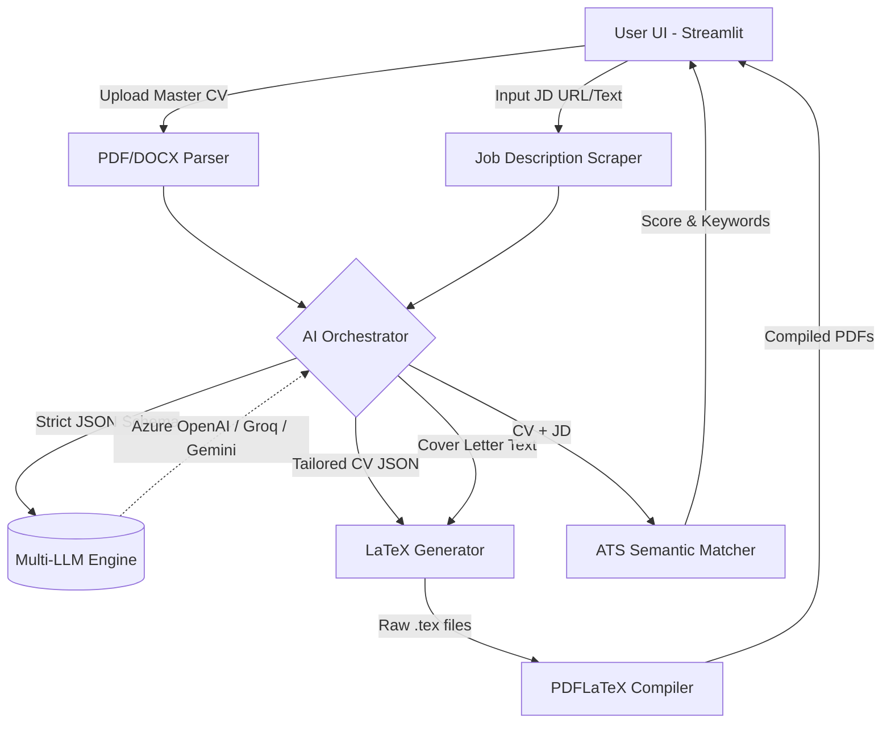

<div align="center">
  <h1>🚀 AgenticCV</h1>
  <p><strong>Enterprise-Grade AI Job Application Engine</strong></p>
  
  <p>
    <a href="https://github.com/Bhargav1488-max/AgenticCV/issues"></a>
    <a href="https://github.com/Bhargav1488-max/AgenticCV/pulls"></a>
    <a href="https://github.com/Bhargav1488-max/AgenticCV/blob/main/LICENSE"></a>
  </p>
</div>

---

**AgenticCV** is a powerful, self-hosted AI engine that dynamically tailors your Master CV and Cover Letter to any Job Description in seconds. Powered by multi-agent architectures and multiple LLM providers (Azure OpenAI, GPT-4, Groq, Gemini), it guarantees high ATS matching, flawless LaTeX compilation, and real-time semantic analysis.

## ✨ Features

- 🧠 **Multi-LLM Engine:** Native support for Azure OpenAI, OpenAI, Anthropic, Google Gemini, Groq, Cohere, Mistral, and local Ollama models.
- 📄 **LaTeX Compilation Pipeline:** Generates perfect, professional, and deterministic PDFs by compiling dynamic JSON outputs directly into LaTeX `\role` templates.
- 📊 **Real-Time ATS Scoring:** Built-in Applicant Tracking System simulator that scores your tailored CV, identifies missing keywords, and provides actionable recommendations.
- 🎯 **Surgical Tailoring:** UI toggles allow you to choose exactly which sections to modify (Title, Summary, Skills, Experience) while preserving historical accuracy.
- 🕸️ **Automated JD Scraping:** Paste a job description or provide a URL to automatically scrape and parse the role requirements.
- 🐳 **Cloud-Native & Dockerized:** Ready to deploy anywhere—Streamlit Cloud, Hugging Face Spaces, Render, AWS, or your local machine.

## 🏗️ Architecture



## 🚀 Getting Started (Local Development)

### Prerequisites
- Python 3.10+
- A working LaTeX distribution (e.g., [TeX Live](https://tug.org/texlive/) or [MiKTeX](https://miktex.org/)) installed and added to your system PATH.

### 1. Clone the repository
```bash
git clone https://github.com/Bhargav1488-max/AgenticCV.git
cd AgenticCV
```

### 2. Set up the virtual environment
```bash
python -m venv venv
source venv/bin/activate  # On Windows use `.\venv\Scripts\activate`
pip install -r requirements.txt
```

### 3. Run the Application
```bash
streamlit run app.py
```

## 🐳 Docker Deployment

To deploy AgenticCV on any server or cloud provider with zero LaTeX configuration overhead:

```bash
# Build the image
docker build -t agentic-cv .

# Run the container
docker run -p 8501:8501 agentic-cv
```
Access the application at `http://localhost:8501`.

## ⚙️ Configuration

You can configure your API keys directly within the UI Sidebar, or set them as environment variables to skip manual entry:

```env
AZURE_OPENAI_ENDPOINT=https://your-resource.openai.azure.com/
AZURE_OPENAI_API_VERSION=2024-02-01
OPENAI_API_KEY=sk-...
GROQ_API_KEY=gsk_...
GEMINI_API_KEY=AIza...
```

## 📜 License

Distributed under the MIT License. See `LICENSE` for more information.

---
*Built with ❤️ for AI Engineers and DevOps Professionals.*
